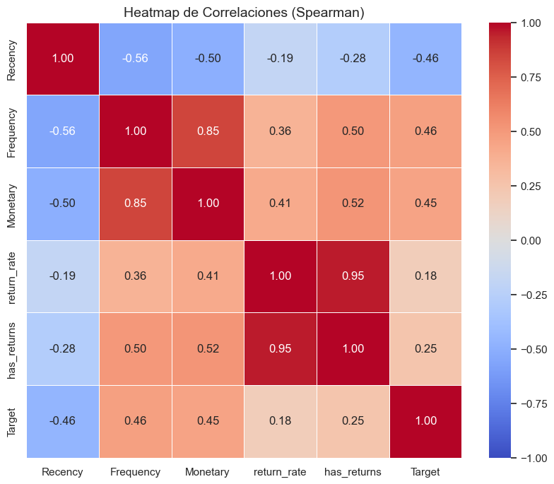
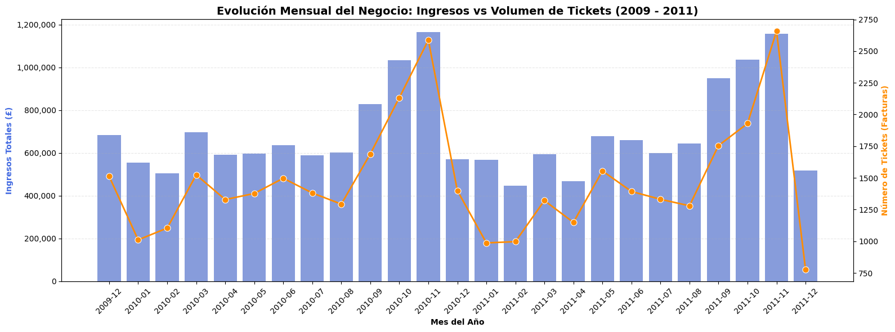
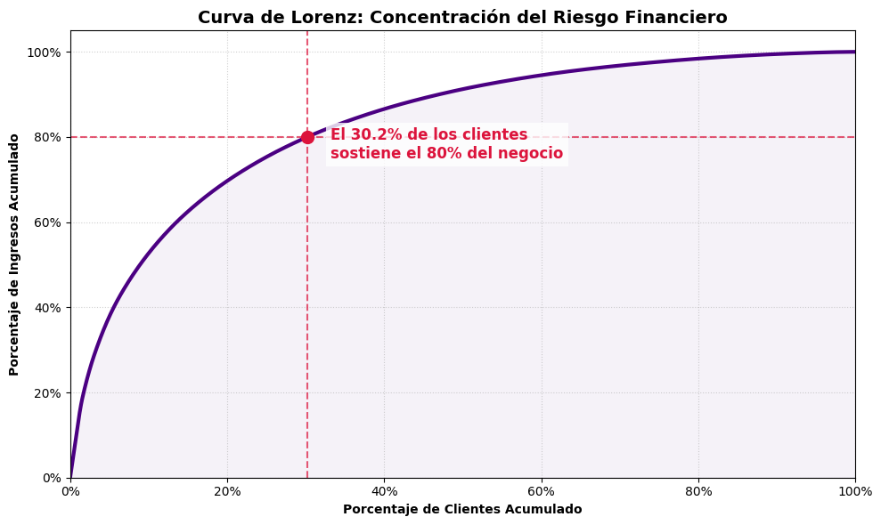
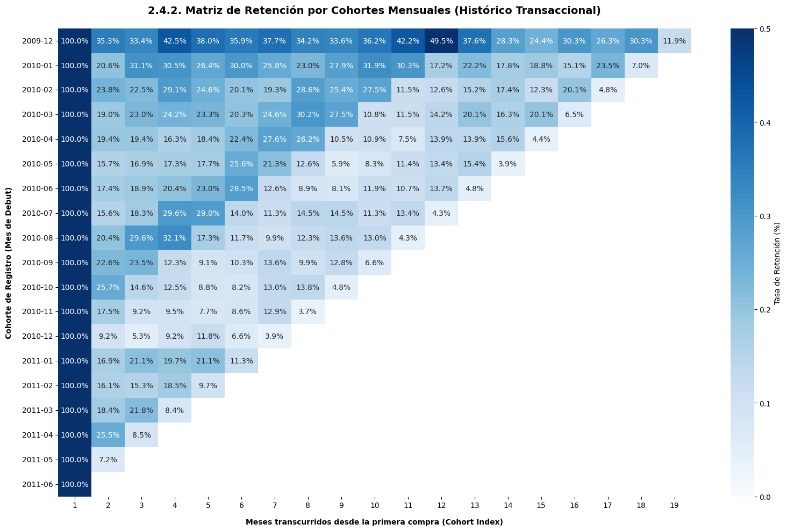
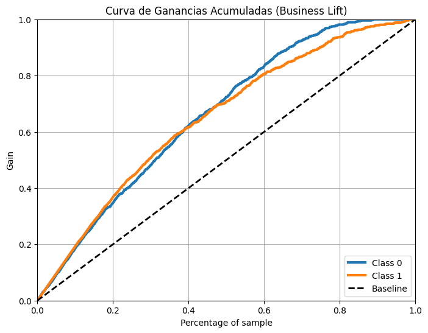
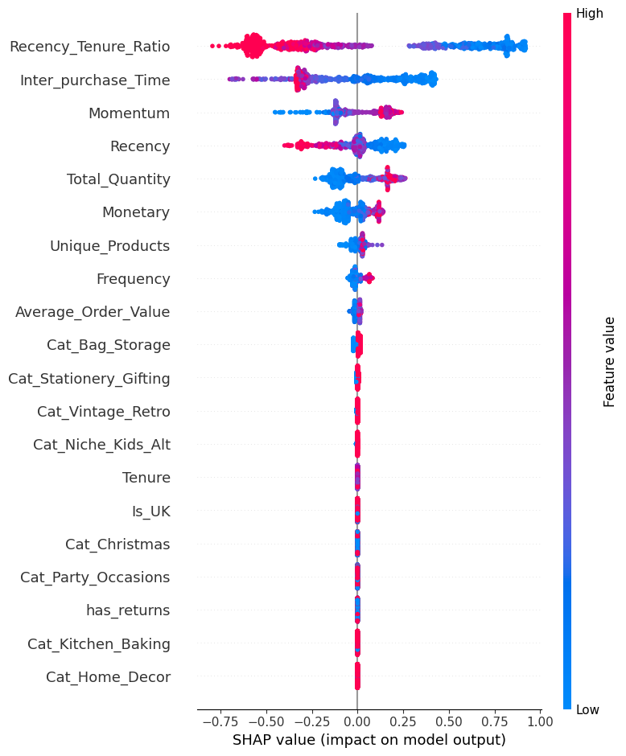

# Proyecto Analítico: Predicción de Recompra y Estrategia de Fidelización

**Rol:** Senior Data Scientist
**Objetivo:** Desarrollar un modelo que prediga la probabilidad de que un cliente vuelva a comprar, permitiendo al equipo de negocio dirigir sus campañas de retención y fidelización de manera rentable e inteligente.

A lo largo de este documento detallamos el proceso end-to-end, desde la obtención y purificación de los datos brutos hasta la implementación del motor predictivo, asegurando siempre que cada decisión matemática tenga una traducción directa y accionable para el negocio.

---

## 1. Introducción y Contexto del Negocio

Como principal Data Scientist de la compañía minorista online, se nos presentó el reto de trabajar con el histórico de transacciones (diciembre 2009 - diciembre 2011). La empresa vende principalmente artículos de regalo y posee un fuerte volumen de negocio B2B (mayoristas). 

El objetivo primordial no es simplemente crear un modelo matemático, sino **transformar datos en decisiones comerciales**. Debemos identificar qué clientes tienen alta probabilidad de volver a comprar (para afianzar su fidelidad con incentivos premium) y qué clientes están en riesgo de fuga (para impactarlos con campañas de reactivación antes de perderlos). Siguiendo las directrices del proyecto y el rigor analítico, evitamos enfoques puramente teóricos y centramos la evaluación en métricas de coste de oportunidad y Retorno de Inversión (ROI).

---

## 2. Fase 1: Limpieza de Datos y Construcción del "Pasado"

Los datos crudos, a nivel de ticket (casi 1 millón de registros), requerían un proceso de limpieza exhaustivo para convertirse en información valiosa.

### 2.1. Depuración del Histórico
1. **Eliminación de "Guest Checkouts":** Se eliminaron unos 243,000 registros sin `Customer ID`. Al no estar registrados, no podemos crear un historial de cliente (no sabemos si volvieron o no), por lo que introducían ruido al modelo.
2. **Duplicados y Anomalías Numéricas:** Limpiamos errores del sistema, precios cero o negativos (ajustes contables) y cantidades negativas (devoluciones). Las devoluciones fueron excluidas de los cálculos de volumen para no falsear los ingresos reales, pero se utilizaron para crear un "ratio de devoluciones" por cliente, un claro indicador de insatisfacción.

### 2.2. Diseño del Marco Temporal (Time Splitting)
Para evitar el error más grave en Data Science ("Fuga de Datos" o *Data Leakage*), dividimos nuestros datos en dos ventanas usando como fecha de corte **junio de 2011**:
* **Ventana de Observación (Pasado):** Desde el inicio hasta junio de 2011. Usada exclusivamente para calcular el comportamiento del cliente.
* **Ventana de Predicción (Futuro):** Los últimos 6 meses del dataset. Usada para ver, de los clientes que teníamos en el pasado, **quién volvió a comprar (1)** y **quién no (0)**. 

El resultado fue un dataset perfectamente balanceado, con un 51.88% de clientes retenidos y un 48.12% de clientes fugados.

---

## 3. Ingeniería de Características: Definiendo el ADN del Cliente

Transformamos las facturas en un dataset donde cada fila es un cliente único. Para que el modelo pueda predecir, necesita "entender" a la persona a través de variables de negocio (Feature Engineering):

1. **Variables RFM Tradicionales:** Recencia (días desde la última compra), Frecuencia (número de tickets) y Valor Monetario (gasto total).
2. **Aficiones y Estilo de Vida (NLP):** Analizamos empíricamente las descripciones de los productos más vendidos usando lenguaje natural, extrayendo 8 clústeres reales como *Home Decor*, *Vintage Retro*, o *Party Occasions*.
3. **Métricas de Ciclo de Vida:** Ticket medio, variedad de productos comprados, antigüedad en días y la **Tendencia de Gasto (Momentum)**, midiendo si el cliente aceleró o frenó sus compras recientemente.

### 3.1. La Variable Estrella: Índice de Salud (Recency-Tenure Ratio)
El tiempo sin comprar (`Recency`) es engañoso: 60 días inactivo es grave para alguien que compra semanalmente, pero normal para un mayorista semestral. Creamos el **Recency-Tenure Ratio** (Recencia / Antigüedad). Si el ratio se acerca a 1, significa que el cliente ha pasado casi todo su ciclo de vida "inactivo" (alto riesgo de fuga).

*Insight del Heatmap:* Confirmamos matemáticamente que la `Frequency` y el `Monetary` están íntimamente ligados (la retención se basa en la recurrencia, no en compras únicas abultadas).

---

## 4. Diagnóstico de Negocio (Business Storytelling)

Antes de predecir el comportamiento individual, debíamos entender el comportamiento macro.

### 4.1. Estacionalidad Extrema (El Efecto Q4)

Descubrimos que la facturación de la empresa tiene un pico monumental en el último trimestre (Navidad). Perder a un cliente justo antes del Q4 tiene un coste de oportunidad enorme. Las campañas de retención deben ser sumamente agresivas entre agosto y octubre.

### 4.2. Análisis de Pareto (Concentración del Riesgo)

Confirmamos que aproximadamente un **30% de los clientes genera el 80% de los ingresos totales**. Esto justifica económicamente nuestro modelo predictivo: no necesitamos lanzar campañas masivas con descuentos a todo el mundo (destruyendo el margen), sino usar el modelo como un radar para detectar y proteger a este núcleo VIP de alto valor.

### 4.3. Productos "Gancho" y Desgaste (Cohortes)
* **Los Cebos de Retención:** Extrajimos el Top 10 de productos estrella para los clientes VIP. Artículos como el *REGENCY CAKESTAND 3 TIER* son los verdaderos fidelizadores. Recomendamos al equipo de Marketing usarlos en las promociones hiper-personalizadas en vez de descuentos genéricos.
* **El Abismo del Segundo Mes:** Nuestro análisis de cohortes (ver abajo) demostró que la mayor tasa de fuga se produce tras el primer mes. Las estrategias de "onboarding" post-primera compra son críticas.

---

## 5. El Motor Predictivo (Machine Learning)

Sometimos a cuatro familias de algoritmos a una rigurosa competición matemática (validación cruzada), priorizando la métrica **AUC** (Área bajo la curva ROC), ya que evalúa la capacidad pura del modelo para separar a los recompradores de los fugitivos en todo el espectro de probabilidades.

1. **Random Forest y Regresión Logística** dominaron inicialmente, indicando relaciones fuertemente lineales en los datos.
2. **XGBoost (El Campeón Optimizado):** Inicialmente sobreajustaba (se aprendía el dataset de memoria). Tras una fase de *Optimización Exhaustiva (GridSearchCV)*, restringimos su profundidad y velocidad de aprendizaje. El **XGBoost Optimizado** logró el mayor desempeño predictivo con una brecha de error (overfitting) mínima.

### 5.1. Impacto en Negocio: La Curva Lift

*Insight Directivo:* ¿Por qué nos importa este modelo? Si Marketing solo tiene presupuesto para enviar un catálogo premium al 30% de la base de datos, hacerlo de forma aleatoria captaría solo al 30% de los futuros compradores. Utilizando nuestro modelo, enfocándonos en el 30% con mayor probabilidad, capturamos a **la inmensa mayoría de los clientes retenibles**. Esto multiplica drásticamente el ROI de la campaña.

### 5.2. Umbrales Dinámicos (Precision vs Recall)
Adecuamos el modelo al bolsillo de Marketing:
* **Coste Alto de Campaña (Ej. Regalo físico):** Subimos el umbral matemático. Maximizamos la **Precisión** para no tirar dinero en falsos positivos.
* **Coste Bajo (Ej. Email masivo) pero cliente valioso:** Bajamos el umbral. Maximizamos el **Recall** para no dejar escapar a ningún cliente VIP que amague con irse.

---

## 6. Interpretabilidad: Las Palancas de la Retención

Un modelo "caja negra" no es útil para la dirección estratégica. Extraímos qué variables pesaban más en la toma de decisión del algoritmo (Feature Importance y Valores SHAP):

* **El Asesino Silencioso (Riesgo Crítico):** El `Recency_Tenure_Ratio`. Si este indicador aumenta, el cliente se asume como perdido. Las alarmas de retención deben activarse en cuanto este ratio se desvía de lo normal.
* **El Protector de Ingresos (Impulsor de Retención):** El `Total_Quantity` y la `Frequency`. Acostumbrar al cliente a hacer pedidos repetidos (hábitos de consumo) protege más la facturación a largo plazo que empujarlo a hacer una sola compra muy cara (`Monetary`).

### 6.1. El Entregable
El modelo fue exportado para producción (MLOps), y se generó el listado final para el CRM cruzando la **Probabilidad de Recompra con el Ticket Medio**, obteniendo el **Ingreso Esperado (Expected Revenue)** por cliente, permitiendo a la empresa priorizar llamadas y correos basándose puramente en impacto económico.

---

## 7. Hoja de Ruta y Próximos Pasos (Evolución del Producto)

Este proyecto representa un Producto Mínimo Viable (MVP - V 1.0) sumamente robusto y rentable. Sin embargo, en Data Science el valor real se genera iterando. Proponemos la siguiente hoja de ruta dividida en "Quick Wins" (corto plazo) y "Transformación" (largo plazo):

### 7.1. Corto Plazo: Mejoras Incrementales (Hacia la V 1.5)
Antes de cambiar la arquitectura, debemos exprimir el modelo actual con acciones de bajo coste y alto impacto:
1. **A/B Testing en Vivo:** Desplegar las predicciones actuales sobre una pequeña porción del tráfico real (grupo de tratamiento) y comparar la retención contra un grupo de control. Esto validará empíricamente el ROI (Lift) antes de hacer un despliegue masivo.
2. **Feature Engineering Granular:** Incorporar variables más finas sin cambiar el algoritmo. Por ejemplo: extraer el patrón de compras (¿compra en fin de semana o entre semana?), o calcular la varianza de días entre compras para detectar a los clientes más erráticos.
3. **Optimización Bayesiana:** Sustituir la búsqueda en cuadrícula (GridSearch) por algoritmos probabilísticos para rascar unas décimas más de AUC ajustando el XGBoost con mayor precisión.

### 7.2. Largo Plazo: Evolución Tecnológica (Hacia la V 2.0)
Una vez validada la versión basal, el salto cualitativo del producto implicará:
1. **De Clasificación a Predicción de Valor (CLV Total):** Pasar de predecir de forma binaria (Comprará / No comprará) a modelos de regresión avanzados para estimar el **Customer Lifetime Value (CLV)** exacto en libras que ese cliente dejará en el próximo año.
2. **Modelos Secuenciales (Deep Learning):** Reemplazar la "foto estática" actual (RFM) por arquitecturas neuronales secuenciales (como LSTMs o Transformers tabulares) para aprender el "ritmo temporal" exacto de las compras y predecir no solo *si* comprará, sino *cuándo* lo hará.
3. **Motores de Recomendación (Cross-Sell):** Complementar la alerta de fuga con filtrado colaborativo. Si sabemos que un VIP se va, sugerir automáticamente a Marketing los 3 artículos "gancho" específicos con mayor probabilidad de conversión para *ese* usuario.
